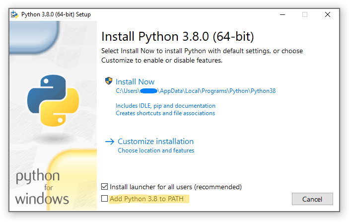
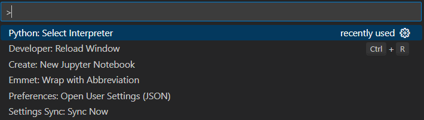
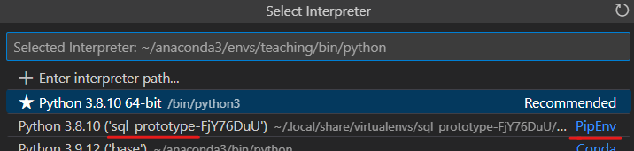
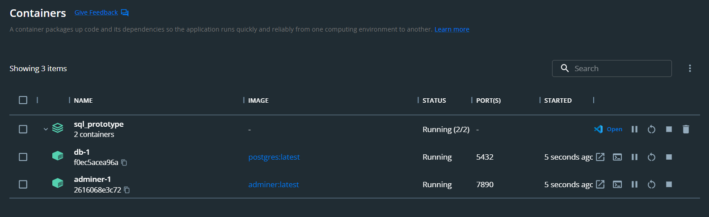
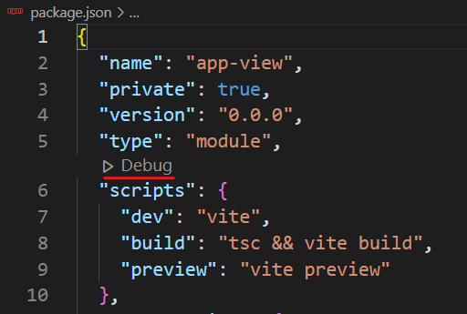

<!-- write about how to create their own pipenv, then install flask and python -->

# Database Management Application Prototype
The role of this small web relation management application is to be a standard where the student may extend the capabilities integrating more relational operations. The view of the application is written in a compact view (front-end) library `React`, in `TypeScript`. Feel free to check the *detailed comments* on the code to get to know what it does. The **main part**, the back-end operations are written in Python, using the library `flask`, and PostgresQL is used as the database engine. The directory structure and program architecture is given below and to activate/setup the environment, follow the instructions below.
## Directory Structure
1. `docker-compose.yaml` - Docker compose file used to build the Postgres environment and its admin interface
2. `app.py` - codebase of the backend API and database integration. SQL statements to be written here
3. `view/src/api.ts` - codebase communicating the view with the main api (namely functionalities of `app.py`)
4. `view/App.tsx` - main view file where the relation data gathered from the database is rendered
5. `view/components/<View>.tsx` - auxiliary view components used in `App.tsx` to render the relation and the editor application structurally (check the comments in the files for a detailed cover)
### Miscellaneous (you won't need to modify manually):
6. `main.tsx` and `index.css` - entrance point files not to be modified: all content of `App.tsx` and `App.scss` are compiled into them respectively
7. Files including `vite` - config files for a fast build tool Vite 
8. `tsconfig.json` - compiler configuration for  TypeScript
9. `package.json` - includes names and versions of the necessary view libraries used in the application
10. `.gitignore`; `index.html`; `node_modules` - keeps unnecessary files away from version control; main entry point for the browser; folder storing necessary installed JavaScript libraries 

## Setting up Python development environment with `pipenv`

1. On Windows / MacOS / Linux machines - make sure you've installed Python and `python` (or `python3`) executable is accessible from the terminal (bash, batch or powershell). Many Linux-based OS's have Python already installed. On Windows installation, make sure to check the highlighted box. 
[Click here to see a full installation guide for Windows / MacOS / Linux machines](https://www.tutorialsteacher.com/python/install-python)

2. To install `pipenv` - Python pip environment manager, run `pip install pipenv` in your terminal. Make sure `pipenv` is also in your OS path and accessible from your shell. *Note that* isolated environments are for protecting your system packages written in Python, in case anything crashes. It also separates your different projects using different names and versions of pip packages.
3. In the current project directory, use `pipenv shell` to enter the virtual environment. Execute `exit` when you want to leave it. 
4. Once you're in the pip environment, run `pip install -r requirements.txt` to install necessary libraries for database management with Python (run `sudo apt-get install libpq-dev` if you face problems on Linux and `brew install postgresql` if you get errors with `pip install psycopg2`).
5. If you're using VSCode with its *Python extension* as your development environment (which is preferable for this project), after creating the `pipenv` environment in the folder, you may enable in-editor for VSCode:
   1. Open Command Pallette using `Shift + Command + P` on Mac and `Ctrl + Shift + P` on Windows/Linux
   
   2. Search and select "Python: Select Interpreter"
   3. Select the newly created `pipenv` environment, which'll have the name of the folder to which you've added the project in it 
   4. Then you can debug your code in full capacity

## Setting up the application view development environment
1. Only thing needed to be installed is `npm` and `vite`. You can select your OS version from [this link](https://nodejs.org/en/download/package-manager/) and see the instructions to install `npm`.
2. After successfully installing `npm`, run the command `npm i -g vite` to globally install `vite` (try `install_npm.sh` to install it on your Linux-based OS). 

## Deploying PostgreSQL DBMS using Docker
1. Make sure you have Docker installed on your device and you can run `docker-compose` command. You may refer to this [link](https://www.docker.com/products/docker-desktop/) in order to do so.
2. You may want to modify the `POSTGRES_PASSWORD` environment variable in the `docker-compose.yml` file if you're going to deploy it to public for security purposes.
3. In the project directory, run `docker-compose up -d` or `docker compose up -d` to build the virtual containers for PostgreSQL and its adminer interface.
4. Default port for the Postgres DBMS is given `5432`, and for admin interface application it's `7890`. You can go to `0.0.0.0:7890` in your browser to visually interact with the DBMS. **Note that**  it's only done for the verification purposes to check if your code works.
5. If both successful, you should see *Running* status for both container (names may differ) in you Docker Desktop application. 
6. Alternatively, you may run `docker ps` command to see the similar view in the shell.

## Running the application (in the Debug / Development mode)
* You can run `app.py` in debug mode in VSCode (`F5` key), or alternatively, use `python app.py` in the terminal where `pipenv` environment is activated
* For the view part, you can simply run `vite` command from the shell in the project directory. If you want to debug in detail, go to `package.json` file in VSCode and run by clicking the hovered Debug button: 
* Now refer to the code to get more closely acquainted!

### Issues and bugs:
* In case you face an error while running `app.py` related to Postgres libraries, try to install psycopg2 again as:
   1. `pip uninstall psycopg2`
   2. `pip install --no-binary :all: psycopg2`
